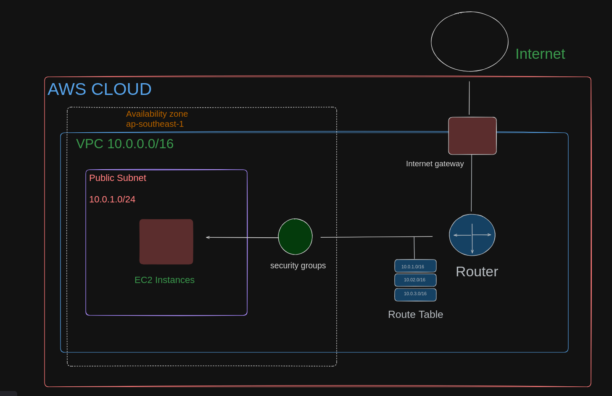

# Launch an EC2 Instance in a Virtual Private Cloud (VPC) 

### This lab  will tech you how to set up a VPC properly from scratch and launch an EC2 in a Virtual Private Cloud(VPC).Before we get started, let’s go over what a VPC

# What is VPC ? 
### A virtual private cloud (VPC) is a secure, isolated private cloud hosted within a public cloud, a VPC is your private space of the AWS cloud to launch and configure your own resources while still being able to take advantage of Amazon’s cloud being highly available, highly scalable and highly durable compared to an on-premise data center.

## Learning Objectives of Todays Lab : 
1. Create a VPC with CIDR 10.0.0.0/16 
2. Create a Public Subnet assigning with valid CIDR blocks.
3. Create Routes and Configure Internet Gateway and attach to vpc .
4. Launch an EC2 instance with the Amazon Linux OS in your subnet .
5. Access EC2 instances

### Alright, now that we know what a VPC is and what are objective is, we can go ahead and get this party started! More definitions will follow as we get to each step…
