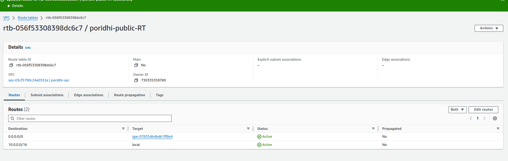
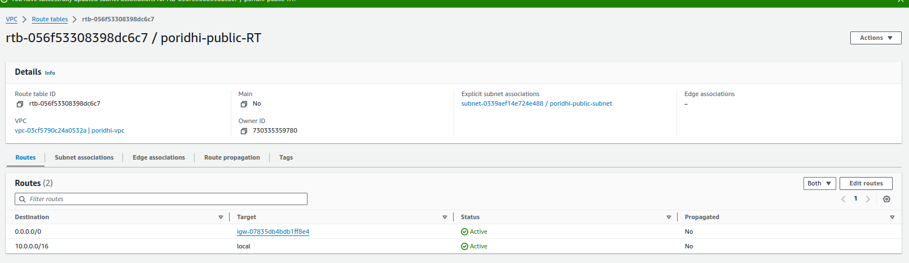
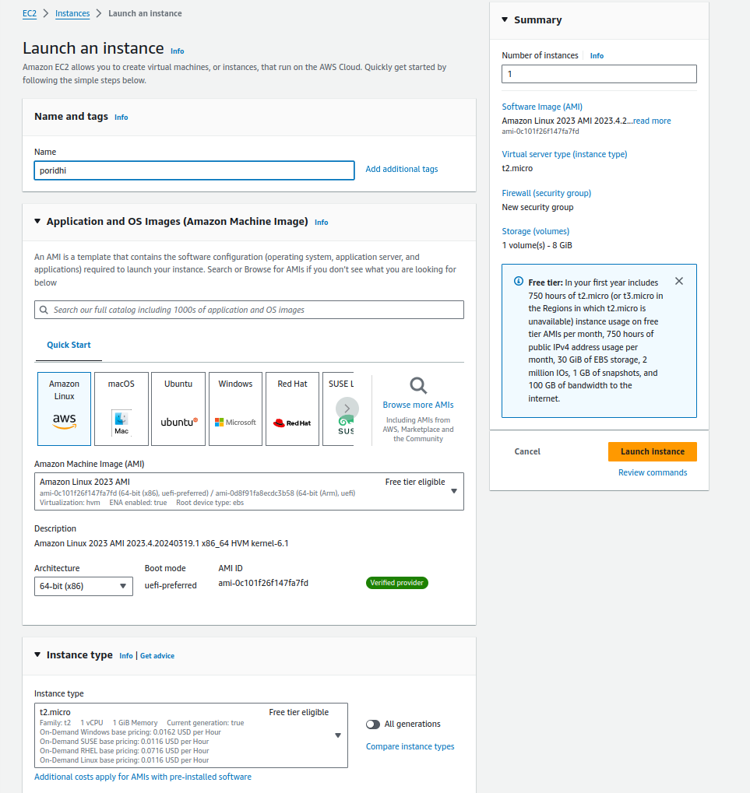
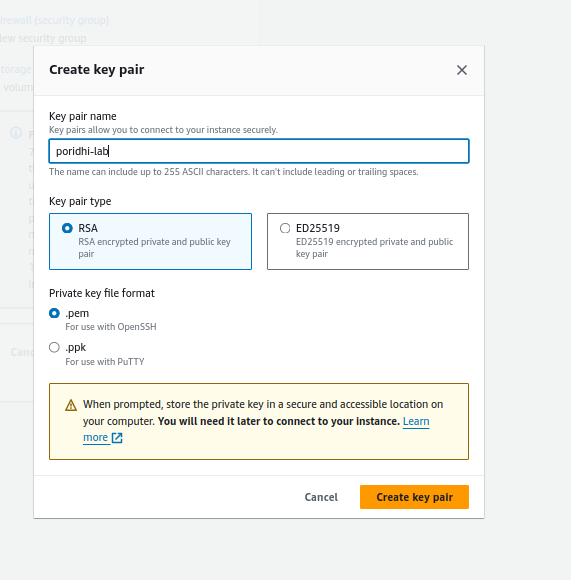
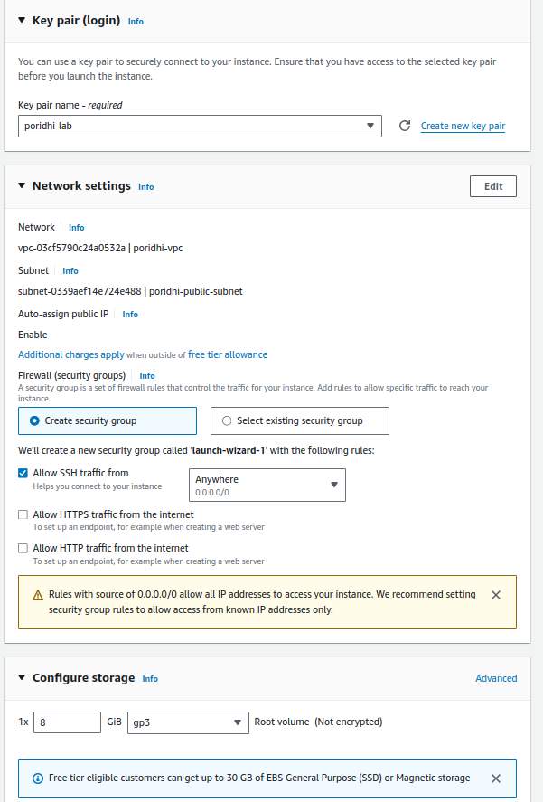
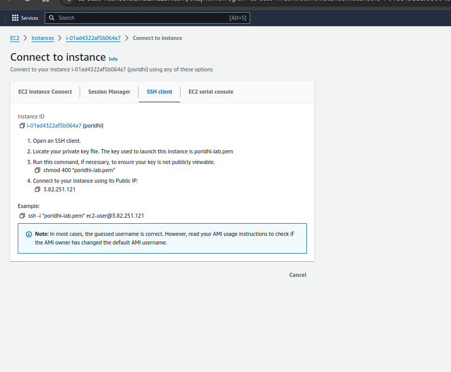
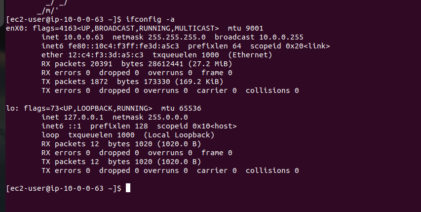
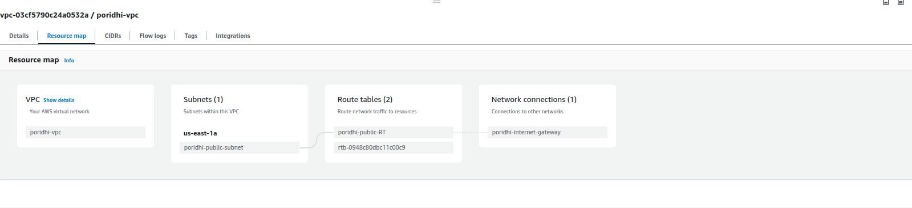

# Launch an EC2 Instance in a Virtual Private Cloud (VPC) 


### This lab  will tech you how to set up a VPC properly from scratch and launch an EC2 in a Virtual Private Cloud(VPC).Before we get started, let’s go over what a VPC

# What is VPC ? 
```bash
 A virtual private cloud (VPC)is a secure, isolated private cloud hosted within a public cloud, a VPC is your private space of the AWS cloud to launch and configure your own resources while still being able to take advantage of Amazon’s cloud being highly available, highly scalable and highly durable compared to an on-premise data center.
```


## Learning Objectives of Todays Lab : 
1. Create a VPC with `CIDR 10.0.0.0/16`
2. Create a Public 'Subnet`assigning with valid 'CIDR`blocks.
3. Create Routes and Configure Internet Gateway and attach to vpc .
4. Launch an `EC2`instance with the Amazon Linux OS in your 'subnet`.
5. Access `EC2`instances

#### Alright, now that we know what a `VPC`is and what are objective is, we can go ahead and get this party started! More definitions will follow as we get to each step…

```bash
Step 1 ---> Create Your VPC 
```
1. In the search bar of the AWS console, search for VPC .
2. First click on your vpcs over here on the left-hand side. 
3. Click on Create VPC up here on the right-hand corner. 


### First thing we will do is name the VPC with a tag. The second is to give it a IPv4 `CIDR` block. CIDR stands for `Classless Inter-Domain` Routing and is a method for allocating IP addresses and for IP routing. A CIDR block is a group of addresses that share the same prefix and contain the same number of bits. Keep this explanation in mind because we will need to understand this later on.


# Congratulations on creating your first VPC 

```bash
Step 2 ---> We'll look at creating a Public Subnet 
```
## VPCs contain subnet or isolated local networks .


### After your `VPC` is created, scroll to the side of the screen and click on subnets and you will be brought to this screen. Now you will essentially just have to designate your `VPC` to the one we just created and choose the rest of the options. Also, make sure you stay in your IPv4 `CIDR` block range!

# Before we move on, what is a subnet?

```bash
A subnet, or subnetwork, is a segmented piece of a larger network. More specifically, subnets are a logical partition of an IP network into multiple, smaller network segments.
```


### Once the subnet is up and running, click on the subnet itself and then click on edit subnet settings. Here is where you will enable auto-assign public IPv4 address and click save . Since you'll eventually instances in this subnet and set it to automatically request Public IP adresses for your instances.

```bash
Step 3 ---> Create Internet Gateways  
```

### The next thing we will do is create a Internet Gateway. On the side of the screen there will be an option for Internet Gateway. Click on it and create internet gateway.

### Now go over to actions and you acctually have attach this internet gateway to a VPC . 


### I believe the definition of an Internet Gateway speaks for itself… It’s in the name! But here is the  [documentation](https://docs.aws.amazon.com/vpc/latest/userguide/VPC_Internet_Gateway.html) in case you need further understanding of what it actually does in detail.

```bash
Step 4 ---> Create Route tables 
```


### The next step is set to configure routing and all this does is tell traffic in the public subnet how to get to the internet. On the side of the left screen, click on Routing Tables and Now you notice there's already a default route table created.This route simply allows traffic to pass to other nodes within the network,but it does not allow traffic to go outside of the network to the public internet . So you'll leave this route table alone, and create one specifically for public internet traffic.Then configure them to access your VPC and the subnets you just created.


### After your Routing table is created, go back to your Routing Tables and add a route that allows it to connect to your Internet Gateway. Once it is active, you are good to continue.



### Now the final step is to associate this public route table that shows how to get to the public internet with your public subnet . In order to do that, 
1. click on the Subnet Associations tab,
2. click on Edit Subnet Associations
3. Let's select our subnet, and click save 
### Great, now your public subnet will allow traffic within it to access the public internet.

```bash
Step 4 --->  Create your EC2 Instance and SSH into it 
```


 ### Alright, now you are at the final step. At the top of the AWS console search for EC2. Click on Launch Instance and then select the AMI and Instance type(t2.micro) 


### create key pair (.pem file) saved in a specific place that you can “cd” to from your local terminal.


### Next  choose the VPC you created and the Public subnet that you want to launch it in and press launch.And Set up your security group to allow at the very least SSH and HTTP

### After instance state running you are going to connect your instance .
1. First select your instance 
2. Click connect 


### Follow the steps to SSH into your instance. Once you follow the steps, you will have the same terminal screen that’s below.


### You can then run the command below to see your if your inet and broadcast are in the same CIDR Block.
```bash
ifconfig -a

```




### And here is a diagram to show you what it actually looks like creating a VPC and all of it’s resources if you do it the proper way having subnets in different AZ’s.


### And here is a diagram to show you what it actually looks like creating a VPC and all of it’s resources if you do it the proper way having subnets in different AZ’s.