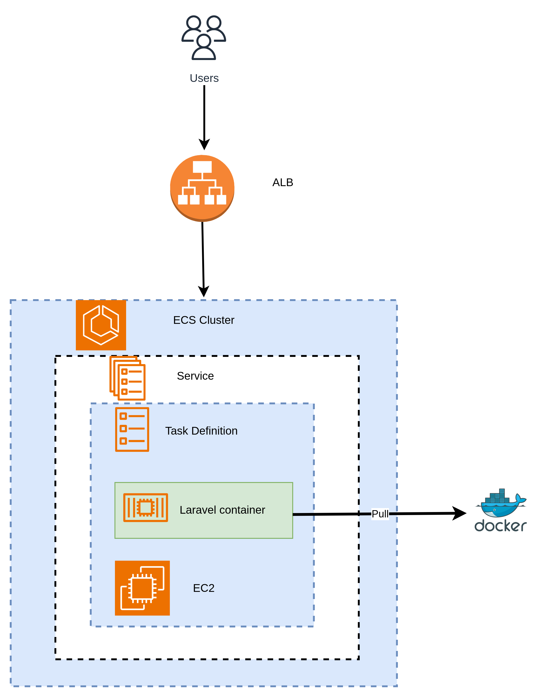

# Deploy Laravel In ECS cluster 

Deploying a Laravel application to AWS Elastic Container Service (ECS) using Docker involves setting up infrastructure components to run the application reliably in a scalable, containerized environment. Below is a detailed guide for deploying Laravel on ECS:




##  Laravel Todo App Setup Guide

### Prerequisites Installation Guide

### 1. Update System
```bash
sudo apt update && sudo apt upgrade
```

### 2. Install PHP and Required Extensions
```bash
sudo apt install php8.1 php8.1- common php8.1-cli php8.1-curl php8.1-mbstring php8.1-xml php8.1-zip php8.1-mysql php8.1-gd unzip
```

To verify PHP installation:
```bash
php --version
```

### 3. Install MySQL
```bash
sudo apt install mysql-server
```

Start MySQL service:
```bash
sudo service mysql start
```

### 4. Configure MySQL
```bash
# Secure the installation
sudo mysql_secure_installation

# Access MySQL
sudo mysql
```

Create database and user:
```sql
CREATE DATABASE your_database_name;
CREATE USER 'your_username'@'localhost' IDENTIFIED BY 'your_password';
GRANT ALL PRIVILEGES ON your_database_name.* TO 'your_username'@'localhost';
FLUSH PRIVILEGES;
EXIT;
```

### 5. Install Composer
```bash
curl -sS https://getcomposer.org/installer | php
sudo mv composer.phar /usr/local/bin/composer
sudo chmod +x /usr/local/bin/composer
```

### 6. Install Node.js and npm
```bash
curl -fsSL https://deb.nodesource.com/setup_18.x | sudo -E bash -
sudo apt install nodejs
```

## Laravel Todo App Setup

### 1. Create New Laravel Project
```bash
composer create-project laravel/laravel todo-app
cd todo-app
```

### 2. Configure Environment
Copy `.env.example` to `.env`:
```bash
cp .env.example .env
```

Update database credentials in `.env`:
```
DB_CONNECTION=mysql
DB_HOST=127.0.0.1
DB_PORT=3306
DB_DATABASE=your_database_name
DB_USERNAME=your_username
DB_PASSWORD=your_password
```

Generate application key:
```bash
php artisan key:generate
```

### 3. Create Todo Migration
```bash
php artisan make:migration create_todos_table
```

Edit migration file in `database/migrations/[timestamp]_create_todos_table.php`:
```php
<?php

use Illuminate\Database\Migrations\Migration;
use Illuminate\Database\Schema\Blueprint;
use Illuminate\Support\Facades\Schema;

return new class extends Migration
{
    public function up(): void
    {
        Schema::create('todos', function (Blueprint $table) {
            $table->id();
            $table->string('title');
            $table->text('description')->nullable();
            $table->boolean('completed')->default(false);
            $table->timestamps();
        });
    }

    public function down(): void
    {
        Schema::dropIfExists('todos');
    }
};
```

### 4. Create Model
```bash
php artisan make:model Todo
```

Edit `app/Models/Todo.php`:
```php
<?php

namespace App\Models;

use Illuminate\Database\Eloquent\Model;

class Todo extends Model
{
    protected $fillable = ['title', 'description', 'completed'];

    protected $casts = [
        'completed' => 'boolean'
    ];
}
```

### 5. Create Controller
```bash
php artisan make:controller TodoController --resource
```

## Common Errors and Solutions

### 1. MySQL Connection Refused

**Error:**
```
SQLSTATE[HY000] [2002] Connection refused
```

**Solutions:**
1. Check if MySQL is running:
```bash
sudo service mysql status
sudo service mysql start
```

2. Verify MySQL credentials in `.env`

3. Check MySQL user permissions:
```sql
SHOW GRANTS FOR 'your_username'@'localhost';
```

4. Reset MySQL password if needed:
```sql
ALTER USER 'your_username'@'localhost' IDENTIFIED WITH mysql_native_password BY 'new_password';
FLUSH PRIVILEGES;
```

### 2. Table Not Found

**Error:**
```
SQLSTATE[42S02]: Base table or view not found: 1146 Table 'database.todos' doesn't exist
```

**Solutions:**
1. Run migrations:
```bash
php artisan migrate
```

2. If migration fails, try:
```bash
php artisan migrate:fresh
```

3. Clear cache:
```bash
php artisan config:clear
php artisan cache:clear
composer dump-autoload
```

### 3. Migration Class Not Found

**Error:**
```
Class "CreateTodosTable" not found
```

**Solutions:**
1. Check migration file naming convention (should be timestamp_create_todos_table.php)

2. Verify migration class structure matches filename

3. Clear autoload files:
```bash
composer dump-autoload
```

4. Recreate migration with correct structure:
```bash
php artisan make:migration create_todos_table
```

### 4. Permission Issues

**Error:**
```
Permission denied
```

**Solutions:**
1. Set proper directory permissions:
```bash
sudo chown -R $USER:www-data storage
sudo chown -R $USER:www-data bootstrap/cache
chmod -R 775 storage
chmod -R 775 bootstrap/cache
```

## Running the Application

1. Start development server:
```bash
php artisan serve
```

2. Access the application:
```
http://localhost:8000/todos
```

## Additional Tips

### Debugging
1. Enable debug mode in `.env`:
```
APP_DEBUG=true
```

2. Check Laravel logs:
```bash
tail -f storage/logs/laravel.log
```

3. Use Laravel Tinker for database testing:
```bash
php artisan tinker
```

### Database Management
1. Reset database:
```bash
php artisan migrate:refresh
```

2. Seed database (if seeders exist):
```bash
php artisan db:seed
```

3. Check database tables:
```bash
php artisan db:show
```

### Cache Management
1. Clear all cache:
```bash
php artisan optimize:clear
```

2. Cache configuration:
```bash
php artisan config:cache
```

Remember to run `npm install` and `npm run dev` if you're using any frontend assets.

` Please set up this directory before build docker image `

```bash
mkdir -p .docker/php
touch .docker/php/php.ini

```
### Dockerfile 

`Create Dockerfle in your root directory and past this ` 

```bash 
# Base Image for the Build Stage
FROM composer:2.5 AS build

# Set the working directory
WORKDIR /app

# Copy application files and install dependencies
COPY . .
RUN composer install --optimize-autoloader --no-dev --no-scripts

# Base Image for the Production Stage
FROM php:8.1-fpm

# Install system dependencies
RUN apt-get update && apt-get install -y \
    libpng-dev \
    libjpeg-dev \
    libfreetype6-dev \
    unzip \
    && rm -rf /var/lib/apt/lists/*

# Install PHP extensions
RUN docker-php-ext-configure gd --with-freetype --with-jpeg \
    && docker-php-ext-install pdo pdo_mysql gd

# Set the working directory
WORKDIR /var/www

# Copy application files from the build stage
COPY --from=build --chown=www-data:www-data /app /var/www

# Set permissions
RUN chmod -R 775 storage bootstrap/cache

# Copy custom PHP configuration
COPY .docker/php/php.ini /usr/local/etc/php/conf.d/custom.ini

# Expose port and define the default command
EXPOSE 8000
CMD ["php-fpm"]


```

Here's a deployment document for setting up MySQL on an Ubuntu EC2 instance:


# **Deploy MySQL on EC2 (Ubuntu)**

This document outlines the steps for deploying MySQL on an Ubuntu EC2 instance.

## **Prerequisites**

- An AWS account.
- SSH access to an EC2 instance running Ubuntu.
- A key pair downloaded to your local machine to access EC2 via SSH.

## **Step-by-Step Guide**

### **Step 1: Launch an Ubuntu EC2 Instance**

1. Log in to the **AWS Management Console** and navigate to **EC2**.
2. Click **Launch Instance**.
3. Select **Ubuntu Server 20.04 LTS (HVM)** AMI.
4. Choose an **Instance Type** (e.g., `t2.micro` for free tier).
5. Configure **Instance Details** as desired.
6. **Add Storage**: Ensure at least 20 GB of storage for MySQL data.
7. **Configure Security Group**:
   - Create or select a security group.
   - Add a rule to allow **inbound traffic on port 3306** for MySQL.
8. Review and click **Launch**. Download the key pair file if prompted.

### **Step 2: Connect to the EC2 Instance**

Using SSH, connect to your EC2 instance:

```bash
ssh -i "your-key-pair.pem" ubuntu@<your-ec2-public-dns>
```

Replace `your-key-pair.pem` with your private key file and `<your-ec2-public-dns>` with the instance’s public DNS.

### **Step 3: Update and Install MySQL**

1. **Update packages**:

   ```bash
   sudo apt update && sudo apt upgrade -y
   ```

2. **Install MySQL Server**:

   ```bash
   sudo apt install mysql-server -y
   ```

3. **Start MySQL Service**:

   ```bash
   sudo systemctl start mysql
   sudo systemctl enable mysql
   ```

### **Step 4: Secure MySQL Installation**

Run the MySQL secure installation script:

```bash
sudo mysql_secure_installation
```

- Follow prompts to set a root password, remove test databases, and disable remote root access.

### **Step 5: Configure MySQL for Remote Access (Optional)**

1. Open the MySQL configuration file:

   ```bash
   sudo nano /etc/mysql/mysql.conf.d/mysqld.cnf
   ```

2. Locate the line `bind-address = 127.0.0.1` and change it to:

   ```ini
   bind-address = 0.0.0.0
   ```

3. Save and exit. Restart MySQL to apply changes:

   ```bash
   sudo systemctl restart mysql
   ```

4. Allow a user to connect remotely:

   ```sql
   mysql -u root -p
   CREATE USER 'yourusername'@'%' IDENTIFIED BY 'yourpassword';
   GRANT ALL PRIVILEGES ON *.* TO 'yourusername'@'%' WITH GRANT OPTION;
   FLUSH PRIVILEGES;
   ```

### **Step 6: Configure Security Group for Remote Access**

1. Go to **EC2 Dashboard** > **Security Groups**.
2. Select the security group associated with your EC2 instance.
3. Edit **Inbound rules** to allow **port 3306** from trusted IPs (e.g., your IP or a specific network).

### **Step 7: Test MySQL Connection**

From a MySQL client, test the remote connection:

```bash
mysql -u yourusername -h <your-ec2-public-dns> -p
```

## **Step 8: Set Up Regular Backups and Maintenance (Optional)**

Consider using tools like `mysqldump` for database backups or configuring automated backup solutions in AWS for data reliability.


This document completes the MySQL deployment on an Ubuntu EC2 instance. Adjust security configurations as needed for production use.

# Deploy Laravel application With ECS cluster 

### Create defult security group and ALB load balancer security group 

**ALB SG** 
 * Allow 80 port from `0.0.0.0` source for http connection 
 * Allow 443 port from `0.0.0.0` source for https connection

**Default SG** 
 * Rule 1 : ` Allow traffic from ALB on port 8000`
    * Type : Custom TCP 
    * Port : 8000
    * Source: `Custom` specify the SG ID of `ALB SG`
 * Rule 2: `Allow SSH for remote management`
    * Type: SSH 
    * Port: 22 
    * Source: `0.0.0.0` or any specific IP range 
 * Rule 3: ` Allow ECS agent communication (port 51678)` 
    * Type: Custom TCP 
    * Port : 51678 
    * Source: 0.0.0.0 or VPC cidr 

### **Step 1: Create an ECS Cluster**
1. **Navigate to the ECS Dashboard** in the AWS Management Console.
2. Click on **Get Started** and select **Create Cluster**.
3. **Name** your cluster (e.g., `example-cluster`).


4. Select **Amazon EC2 instance** as the launch type.
5. Choose **Amazon Linux 2023** for the OS.
6. Choose **t2.micro** as the instance type (for free tier).
7. Leave the rest of the settings as default.
8. Click **Create** to complete the cluster creation.


9. Choose two security group 
  * default secuirty group 
  * alb secuirty group 


### **Step 2: Create a Target Group**
1. Open the **EC2 Dashboard** in the AWS Management Console.
2. In the left-hand menu, under **Load Balancing**, click **Target Groups**.
3. Click **Create Target Group**.
4. Select **Instance** as the target type.
5. Provide a name for your target group (e.g., `example-tg`).
6. Set the **protocol** to **HTTP** and the **port** to match your Docker container’s port (e.g., 8080).
7. In the **Health check** section, set the path to `/health`.


### **Step 3: Create an Application Load Balancer (ALB)**
1. Go to **Load Balancers** under the **EC2** section.
2. Click **Create Load Balancer** and select **Application Load Balancer**.
3. Provide a unique name (e.g., `example-lb`).
4. Under **Network Mapping**, select at least two subnets for redundancy and also select `alb secuirty group` .
5. In the **Listeners** section, select **HTTP** and port **80**.
6. In the **Routing** section, select the target group you created earlier (`example-tg`).
7. Click **Create**.


### **Step 4: Create an ECS Task Definition**
1. Navigate to the **ECS Dashboard** and go to **Task Definitions**.
2. Click **Create New Task Definition**.
3. Choose **EC2** as the launch type.
4. Provide a name for the task (e.g., `example-t`).
5. Select **Bridge** as the network mode if your container needs to communicate externally.


6. In the **Container Definitions** section:
   - Provide a name for the container (e.g., `example-container`).
   - Enter the **Image URI** of your Docker image (e.g., `docker.io/your-username/example-app:latest`).
   - Set the **port mappings** (host port 8000 to container port 8000).


7. Add any necessary environment variables for your application.


` You have to set this environment for Laravel app `

8. Click **Create** to finish creating the task definition.

`Note` 

**Before creating ECS Service you have to create a EC2 server with following this rules** 
* Instance type : t3.medium 
* OS : Amazon Linux 2023 AMI 
* Security group : `Default SG `

**Check for Correct IAM Role**
* The EC2 instances need to be assigned the `AmazonEC2ContainerServiceforEC2Role`(or equivalent) IAM role. This allows the ECS agent to communicate with ECS.
* Ensure this IAM role is attached to your EC2 instances:
* In the EC2 Console, go to Instances, select the instance, `then Actions > Security > Modify IAM role to attach the role`


### **Step 5: Create an ECS Service**
1. Go to your **ECS cluster** and click on the **Services** tab.
2. Click **Create**.
3. In the **Task Definition** section, set `Environment` following below image 

 

4. select your task definition and revision (e.g., `example-t`). Provide a name for the service (e.g., `example-s`).


5. Set the desired number of tasks (e.g., `1`).
6. Under the **Load Balancing** section, choose your previously created Application Load Balancer (`example-lb`).
7. Select the existing target group (`example-tg`).
8. Set the **Health check grace period** to 60 seconds.


9. Click **Create Service** to complete the setup.

` After creating Service then monitor deployment tab `


` After runing your task you should to go Network configuration under configuration and networking tab And open this DNS in your browser `
  

[dns](https://s3.brilliant.com.bd/blog-bucket/thumbnail/f4c626c6-656b-4798-aed0-235ed83c5154.png)
---

And Finally Here is Laravel to do app ecs


